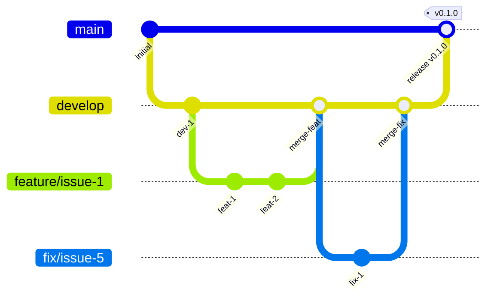

# Contributing to wagtail-scenario-test

Thank you for your interest in contributing!

## Development Setup

### Prerequisites

- Python 3.10+ (for basic development)
- **Python 3.10, 3.11, 3.12, 3.13** (for full matrix testing with tox)
- **uv 0.9.0+** (recommended) or pip
  - Check version: `uv --version`
  - Update: `curl -LsSf https://astral.sh/uv/install.sh | sh`

#### Installing Multiple Python Versions

For full matrix testing, you'll need all supported Python versions installed.

**Using uv (recommended):**
```bash
# Install all supported Python versions
uv python install 3.10 3.11 3.12 3.13

# Verify installations
uv python list
```

**Alternative: Using pyenv:**
```bash
# Install pyenv
curl https://pyenv.run | bash

# Install all supported Python versions
pyenv install 3.10.16
pyenv install 3.11.11
pyenv install 3.12.8
pyenv install 3.13.1

# Make them available globally
pyenv global 3.13.1 3.10.16 3.11.11 3.12.8
```

### Clone and Setup

```bash
git clone https://github.com/kkm-horikawa/wagtail-scenario-test.git
cd wagtail-scenario-test

# Using uv (recommended)
uv venv
source .venv/bin/activate
uv pip install -e ".[dev]"

# Or using pip
python -m venv .venv
source .venv/bin/activate
pip install -e ".[dev]"
```

> **Note:** We use `uv pip install` instead of `uv sync` because this is a **library project**.
> We don't commit `uv.lock` to maintain dependency flexibility for downstream users.
> See [Project Management](#project-management) for more details.

### Running Tests

#### Python Tests

```bash
pytest
```

### Running Matrix Tests Locally

To test against all supported Python/Django/Wagtail combinations:

```bash
# Install tox
uv pip install tox

# Run all combinations
tox

# Test specific Python version
tox -e py313

# Run in parallel (faster)
tox -p auto

# List all available environments
tox -l
```

## Supported Versions

### Python Versions
- **3.10** (minimum)
- **3.11**
- **3.12**
- **3.13** (latest)

### Django Versions
- **4.2** (LTS - Long Term Support until April 2026)
- **5.1**
- **5.2**

### Wagtail Versions
- **6.4**
- **7.0**
- **7.2** (latest)

### Code Style

```bash
# Format code
ruff format .

# Lint
ruff check .

# Type check
mypy src/
```

## Coding Standards

### Overview

| Item | Standard |
|------|----------|
| Formatter/Linter | [Ruff](https://docs.astral.sh/ruff/) |
| Line length | 88 characters |
| Quotes | Double quotes `"` |
| Type hints | Required for public APIs |
| Docstrings | Google style |

### Naming Conventions

| Type | Convention | Example |
|------|------------|---------|
| Class | PascalCase | `WagtailAdminPage`, `SnippetAdminPage` |
| Function/Method | snake_case | `navigate_to_list`, `create_item` |
| Variable | snake_case | `page_url`, `admin_page` |
| Constant | UPPER_SNAKE_CASE | `DEFAULT_TIMEOUT`, `ADMIN_PATH` |
| Private method | _leading_underscore | `_wait_for_element` |

### Type Annotations

Required for:
- All function parameters and return types
- Public methods
- Complex variables

```python
def navigate_to_list(
    self,
    wait_for_load: bool = True,
) -> None:
    """Navigate to the snippet list page.

    Args:
        wait_for_load: Whether to wait for page load.
    """
    self.page.goto(f"{self.base_url}{self.list_url}")
    if wait_for_load:
        self.page.wait_for_load_state("networkidle")
```

### Import Order

```python
# 1. Standard library
from typing import Any

# 2. Third-party packages
from django.db import models
from wagtail.models import Page

# 3. Local imports
from wagtail_scenario_test import SnippetAdminPage
```

Ruff's isort will automatically organize imports.

### Testing Standards

#### Test Structure

```
tests/
├── conftest.py                  # Shared fixtures
├── test_page_objects.py         # Page Object tests
├── test_fixtures.py             # Fixture tests
├── test_factories.py            # Factory tests
└── test_integration.py          # Integration tests
```

#### Test Naming

```python
class TestSnippetAdminPage:
    """Tests for SnippetAdminPage."""

    def test_navigate_to_list(self):
        """SnippetAdminPage navigates to list page."""
        ...

    def test_create_item(self):
        """SnippetAdminPage creates new item."""
        ...

    def test_edit_existing_item(self):
        """SnippetAdminPage edits existing item."""
        ...
```

Naming pattern: `test_<what>_<condition/expectation>`

#### Running Tests

```bash
# Run all tests
pytest

# Run with coverage
pytest --cov=wagtail_scenario_test --cov-report=html

# Run specific test file
pytest tests/test_models.py

# Run specific test
pytest tests/test_models.py::TestSEOSettings::test_settings_instantiation
```

#### Coverage Target

- Overall: 90%+
- Page Objects: 95%+
- Fixtures: 90%+

## Project Structure

```
wagtail-scenario-test/
├── src/
│   └── wagtail_scenario_test/
│       ├── __init__.py
│       ├── page_objects/        # Page Object classes
│       │   ├── __init__.py
│       │   ├── base.py          # BasePage
│       │   └── wagtail_admin.py # WagtailAdminPage, SnippetAdminPage
│       ├── fixtures/            # pytest fixtures (auto-registered)
│       │   └── __init__.py
│       └── factories/           # factory_boy utilities
│           └── __init__.py
├── tests/
├── pyproject.toml
├── README.md
└── CONTRIBUTING.md
```

## Branch Strategy

We use a modified Git Flow strategy:



### Branch Types

| Branch | Purpose | Base | Merge To |
|--------|---------|------|----------|
| `main` | Production releases | - | - |
| `develop` | Development integration | `main` | `main` |
| `feature/*` | New features | `develop` | `develop` |
| `fix/*` | Bug fixes | `develop` | `develop` |
| `hotfix/*` | Urgent production fixes | `main` | `main` + `develop` |
| `chore/*` | Maintenance, config, dependencies | `develop` | `develop` |
| `docs/*` | Documentation updates | `develop` | `develop` |

### Branch Naming

```
feature/<issue-number>-<short-description>
fix/<issue-number>-<short-description>
hotfix/<issue-number>-<short-description>
chore/<short-description>
docs/<short-description>
```

Examples:
- `feature/1-seo-settings-model`
- `fix/12-og-image-url-bug`
- `hotfix/15-security-patch`
- `chore/update-dependencies`
- `docs/api-reference`

### Protected Branches

| Branch | Direct Push | PR Required | Delete Protection |
|--------|-------------|-------------|-------------------|
| `main` | No | Yes | Yes |
| `develop` | No | Yes | Yes |

## Development Workflow

### For External Contributors (Fork-based)

1. **Fork the repository** on GitHub
2. **Clone your fork**:
   ```bash
   git clone https://github.com/<your-username>/wagtail-scenario-test.git
   cd wagtail-scenario-test
   ```
3. **Add upstream remote**:
   ```bash
   git remote add upstream https://github.com/kkm-horikawa/wagtail-scenario-test.git
   ```
4. **Create a branch from develop**:
   ```bash
   git fetch upstream
   git checkout -b feature/<issue-number>-<description> upstream/develop
   ```
5. **Make changes, commit, and push to your fork**:
   ```bash
   git push origin feature/<issue-number>-<description>
   ```
6. **Create a Pull Request** from your fork to `upstream/develop`

### For Maintainers (Direct)

We recommend using **Draft PRs** for planning and early feedback.

#### 1. Check Existing Issues

Before starting work, check the [Issue Tracker](https://github.com/kkm-horikawa/wagtail-scenario-test/issues) and [Project Board](https://github.com/users/kkm-horikawa/projects/9).

- Search for existing issues to avoid duplication
- Comment on the issue to claim it
- If no issue exists, create one first

#### 2. Create a Branch

```bash
# Start from develop
git checkout develop
git pull origin develop

# Create feature or fix branch
git checkout -b feature/<issue-number>-<description>
# or
git checkout -b fix/<issue-number>-<description>
```

#### 3. Create a Draft PR (Recommended)

Creating a Draft PR **before implementing** provides several benefits:

- **Early feedback**: Get architectural guidance before investing time
- **Avoid rework**: Catch potential issues early
- **Communication**: Team knows what you're working on
- **Planning**: Forces you to think through the approach
- **Progress tracking**: Can commit work-in-progress safely

```bash
# Create an empty commit to initialize the PR
git commit --allow-empty -m "feat: initialize <feature name>

Track progress for #<issue-number>"

# Push and create Draft PR
git push -u origin feature/<issue-number>-<description>
```

Then create a **Draft Pull Request** on GitHub with:

- Reference: `Closes #<issue-number>`
- Implementation plan as checkboxes:
  ```markdown
  ## Implementation Plan
  - [ ] Create model
  - [ ] Add template tags
  - [ ] Write tests
  - [ ] Update documentation
  ```
- Test strategy outline

#### 4. Implement

- Follow the plan in your Draft PR
- Write tests for new functionality
- Follow existing code style
- Commit regularly with clear messages
- Update PR checkboxes as you progress

#### 5. Test Your Changes

```bash
pytest
ruff check .
ruff format --check .
mypy src/
```

#### 6. Commit

Follow [Conventional Commits](https://www.conventionalcommits.org/):

```bash
git commit -m "feat: add SEOSettings model"
git commit -m "fix: resolve OG image URL issue"
git commit -m "docs: update installation guide"
```

#### 7. Mark PR as Ready for Review

When implementation is complete:

- Ensure all tests pass locally
- Update documentation if needed
- Mark PR as "Ready for review"

#### 8. Self-Review and Merge

For **maintainers and core contributors**:

- You may approve and merge your own PRs if:
  - All CI checks pass
  - The change is well-documented
  - Tests are included
  - The PR has been open for reasonable time (for feedback)

Use admin privileges to bypass approval requirements when appropriate.

### Release Process (Maintainers only)

When ready to release:
1. Create PR from `develop` to `main`
2. After merge, tag the release: `git tag v0.x.0`
3. Push tag: `git push origin v0.x.0`

## Project Management

### Our Philosophy

This is an **open-source project built by volunteers**. Our management approach reflects this:

- **No time estimates or strict deadlines** - Contributors work at their own pace
- **Quality over speed** - We'd rather ship it right than ship it fast
- **Clear issue descriptions** - Every issue has acceptance criteria
- **Transparent dependencies** - We use parent/child and blocked-by relationships
- **Version-based milestones** - Group features by version, not by date

### Labels

We use labels to categorize and prioritize work:

| Label | Meaning | When to Use |
|-------|---------|-------------|
| `good first issue` | Great for newcomers | Small, well-defined tasks |
| `atomic` | Small, focused issue | No sub-issues needed, single PR |
| `enhancement` | New feature or improvement | Adding functionality |
| `bug` | Something isn't working | Fixing broken behavior |
| `documentation` | Documentation improvements | README, guides, comments |

### GitHub Projects

We use [GitHub Projects](https://github.com/users/kkm-horikawa/projects/9) to track progress:

| Status | Meaning |
|--------|---------|
| **Backlog** | Not yet prioritized |
| **Todo** | Ready to work on |
| **In Progress** | Actively being worked on |
| **In Review** | PR submitted, awaiting review |
| **Done** | Completed and merged |

Contributors can move their assigned issues through the board as they progress.

### Why No Time Tracking?

Unlike commercial software projects, we don't track:
- Story points
- Time estimates
- Sprint deadlines
- Velocity

**Reasons:**
- OSS contributors are volunteers with varying availability
- Forcing deadlines creates unnecessary pressure
- Quality and correctness matter more than speed
- Contributors work at their own pace

Instead, we focus on:
- **What** needs to be done (clear acceptance criteria)
- **Why** it's important (context and motivation)
- **How** it relates to other work (dependencies)

## Questions?

Open an [Issue](https://github.com/kkm-horikawa/wagtail-scenario-test/issues) for questions or discussions.
